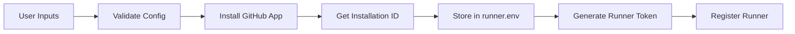
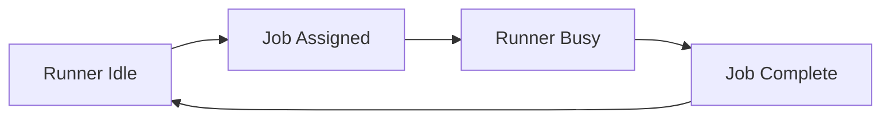
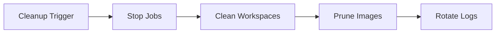
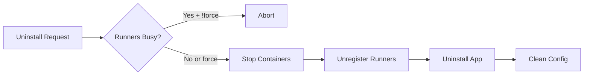

# State Management & Environment Variables

Comprehensive documentation for state management, variable scoping, and persistence in the GitHub Self-Hosted Runner system.

## Table of Contents

1. [State Classification](#state-classification)
2. [Variable Matrix](#variable-matrix)
3. [State Lifecycle](#state-lifecycle)
4. [Best Practices](#best-practices)

---

## State Classification

### Stateless Operations

**Definition**: Read-only operations that don't modify external state.

**Characteristics**:
- ✅ Idempotent (can be run multiple times safely)
- ✅ No side effects
- ✅ Cacheable results
- ✅ Fast and predictable

**Actions**:
- `validate-app-permissions` - Checks permissions
- `check-runner-status` - Reads runner status
- `list-runners` - Lists runners
- `get-runner-version` - Fetches version info
- `get-installation-id` - Reads installation ID

**Variables Used**: Read-only (GITHUB_APP_ID, REPO_URL, etc.)

---

### Stateful Operations

**Definition**: Operations that create, modify, or delete external resources.

**Characteristics**:
- ⚠️ Not always idempotent
- ⚠️ Has side effects
- ⚠️ Requires careful orchestration
- ⚠️ May require rollback mechanisms

**Actions**:
- `register-runner` - Creates runner registration
- `unregister-runner` - Removes runner
- `deploy-runner` - Starts containers
- `uninstall-app` - Removes app installation
- `build-runner-image` - Creates Docker images

**Variables Modified**: 
- RUNNER_TOKEN (ephemeral, generated)
- INSTALLATION_ID (persisted after install)
- Container state (Docker volumes, networks)

---

### Hybrid Operations

**Definition**: Operations that combine read and write operations.

**Actions**:
- `generate-runner-config` - Reads templates, writes config
- `merge-config` - Reads multiple sources, outputs merged config
- `validate-config` - Reads config, may suggest fixes

**Idempotency**: Conditional (depends on input determinism)

---

## Variable Matrix

### Core Variables

| Variable | Provider | Namespace | Visibility | Persistence | Stateful | Description |
|----------|----------|-----------|------------|-------------|----------|-------------|
| **GITHUB_APP_ID** | User | `GITHUB_APP_*` | Public | Config file | ❌ No | GitHub App identifier |
| **GITHUB_APP_INSTALLATION_ID** | GitHub API | `GITHUB_APP_*` | Public | Config file | ⚠️ Hybrid | Installation ID (obtained once, reused) |
| **GITHUB_APP_PRIVATE_KEY** | User | `GITHUB_APP_*` | Secret | Secret store | ❌ No | App authentication key |
| **GITHUB_APP_PRIVATE_KEY_PATH** | System | `GITHUB_APP_*` | Public | Config file | ❌ No | Path to private key file |
| **GITHUB_PAT** | User | `GITHUB_*` | Secret | Secret store | ❌ No | Personal Access Token (fallback auth) |
| **REPO_URL** | User | `REPO_*` | Public | Config file | ❌ No | Target repository URL |
| **RUNNER_NAME** | User/System | `RUNNER_*` | Public | Config file | ❌ No | Runner display name |
| **RUNNER_TOKEN** | GitHub API | `RUNNER_*` | Secret | Ephemeral | ✅ Yes | Registration token (time-limited) |
| **RUNNER_VERSION** | User/GitHub | `RUNNER_*` | Public | Config file | ❌ No | Runner binary version |
| **RUNNER_GROUP** | User | `RUNNER_*` | Public | Config file | ❌ No | Enterprise runner group |
| **LABELS** | User | `RUNNER_*` | Public | Config file | ❌ No | Runner labels (comma-separated) |
| **CPU_LIMIT** | User | `RESOURCE_*` | Public | Config file | ❌ No | Max CPU cores |
| **MEMORY_LIMIT** | User | `RESOURCE_*` | Public | Config file | ❌ No | Max memory allocation |
| **DISK_LIMIT** | User | `RESOURCE_*` | Public | Config file | ❌ No | Max disk space for workspace |
| **ENABLE_DOCKER** | User | `DOCKER_*` | Public | Config file | ❌ No | Enable Docker-in-Docker |
| **NETWORK_MODE** | User | `DOCKER_*` | Public | Config file | ❌ No | Docker network mode |
| **DEBUG** | User | `SYSTEM_*` | Public | Config file | ❌ No | Enable verbose logging |
| **CLEANUP_WORKSPACE_DAYS** | User | `MAINTENANCE_*` | Public | Config file | ❌ No | Workspace retention period |

---

### Actions-Specific Variables

| Variable | Provider | Namespace | Visibility | Persistence | Stateful | Description |
|----------|----------|-----------|------------|-------------|----------|-------------|
| **INSTALLATION_TOKEN** | Action | `ACTION_*` | Secret | Job scope | ✅ Yes | Generated during workflow run |
| **RUNNER_ID** | GitHub API | `RUNNER_*` | Public | API response | ✅ Yes | Unique runner identifier |
| **RUNNER_STATUS** | GitHub API | `RUNNER_*` | Public | Ephemeral | ❌ No | Current runner state (online/offline) |
| **RUNNER_BUSY** | GitHub API | `RUNNER_*` | Public | Ephemeral | ❌ No | Whether runner is executing job |
| **JWT_TOKEN** | Action | `AUTH_*` | Secret | Job scope | ❌ No | GitHub App JWT (10min TTL) |
| **VALIDATION_RESULT** | Action | `ACTION_*` | Public | Output only | ❌ No | Permission check result |
| **RUNNERS_JSON** | Action | `ACTION_*` | Public | Output only | ❌ No | List of runners (JSON) |

---

## Variable Scope Definitions

### Provider

Who supplies the variable value:

- **User**: Manually configured by repository owner
- **GitHub API**: Retrieved from GitHub's REST API
- **System**: Generated by the operating system/container
- **Action**: Computed or generated during workflow execution

### Namespace

Logical grouping for organization:

- `GITHUB_APP_*` - GitHub App authentication
- `GITHUB_*` - General GitHub configuration
- `RUNNER_*` - Runner-specific settings
- `RESOURCE_*` - Resource limits and allocations
- `DOCKER_*` - Docker/container configuration
- `SYSTEM_*` - System-level settings
- `MAINTENANCE_*` - Cleanup and maintenance
- `ACTION_*` - Workflow action outputs
- `AUTH_*` - Authentication tokens

### Visibility

- **Public**: Can be logged, displayed in UI
- **Secret**: Must be masked in logs, stored securely

### Persistence

| Type | Lifespan | Storage | Example |
|------|----------|---------|--------|
| **Config file** | Permanent | `config/runner.env` | RUNNER_NAME |
| **Secret store** | Permanent | GitHub Secrets / Vault | GITHUB_APP_PRIVATE_KEY |
| **Ephemeral** | Single use | Memory only | RUNNER_TOKEN |
| **Job scope** | Workflow run | GitHub Actions context | INSTALLATION_TOKEN |
| **Output only** | Action step | `$GITHUB_OUTPUT` | VALIDATION_RESULT |
| **API response** | Real-time | N/A (fetched on-demand) | RUNNER_STATUS |

---

## State Lifecycle

### 1. Installation Phase (Stateful)



**State Changes**:
- ✅ GitHub App installed on repository
- ✅ `GITHUB_APP_INSTALLATION_ID` written to config
- ✅ Runner registered with GitHub
- ✅ `RUNNER_ID` obtained

**Variables Modified**:
- `GITHUB_APP_INSTALLATION_ID` (new)
- `RUNNER_TOKEN` (ephemeral)
- `RUNNER_ID` (new)

---

### 2. Deployment Phase (Stateful)


**State Changes**:
- ✅ Docker image built/pulled
- ✅ Docker network created
- ✅ Container started
- ✅ Runner status: online

**Variables Used**:
- `RUNNER_TOKEN` (read from previous phase)
- `REPO_URL`, `RUNNER_NAME`, `LABELS`
- `CPU_LIMIT`, `MEMORY_LIMIT`

---

### 3. Runtime Phase (Hybrid)



**State Changes**:
- ⚠️ `RUNNER_STATUS`: online
- ⚠️ `RUNNER_BUSY`: true/false (ephemeral)
- ⚠️ Workspace files created/deleted

**Variables Read** (stateless queries):
- `RUNNER_STATUS`
- `RUNNER_BUSY`
- `LABELS`

---

### 4. Maintenance Phase (Stateful)



**State Changes**:
- ✅ Old workspaces deleted
- ✅ Unused Docker images removed
- ✅ Logs rotated

**Variables Used**:
- `CLEANUP_WORKSPACE_DAYS`
- `CLEANUP_DOCKER_HOURS`
- `LOG_MAX_FILES`

---

### 5. Uninstallation Phase (Stateful)



**State Changes**:
- ✅ Containers stopped/removed
- ✅ Runners unregistered
- ✅ GitHub App uninstalled
- ✅ `GITHUB_APP_INSTALLATION_ID` cleared

**Variables Cleared**:
- `GITHUB_APP_INSTALLATION_ID`
- `RUNNER_ID`
- Ephemeral tokens

---

## Best Practices

### 1. Stateless First

**✅ DO**: Use stateless actions for queries and validation

```yaml
- name: Check Status
  uses: ./.github/actions/check-runner-status
  # Stateless - safe to run multiple times
```

**❌ DON'T**: Use stateful actions unnecessarily

```yaml
- name: Register Runner
  uses: ./.github/actions/register-runner
  # Stateful - creates new registration each time
```

---

### 2. Idempotency Guards

**✅ DO**: Check state before stateful operations

```yaml
- name: Check if Already Registered
  id: check
  uses: ./.github/actions/list-runners
  
- name: Register Only if Needed
  if: steps.check.outputs.total_count == 0
  uses: ./.github/actions/register-runner
```

---

### 3. Variable Scoping

**✅ DO**: Use appropriate persistence for each variable type

| Use Case | Storage |
|----------|--------|
| User configuration | `config/runner.env` |
| Secrets | GitHub Secrets / Vault |
| Workflow outputs | `$GITHUB_OUTPUT` |
| Ephemeral tokens | Memory / environment |

---

### 4. Secret Management

**✅ DO**: Always mask secrets in logs

```yaml
steps:
  - name: Use Secret
    env:
      PRIVATE_KEY: ${{ secrets.GITHUB_APP_PRIVATE_KEY }}
    run: |
      echo "::add-mask::$PRIVATE_KEY"
      # Use $PRIVATE_KEY safely
```

**❌ DON'T**: Log secrets directly

```yaml
run: echo "Key: ${{ secrets.PRIVATE_KEY }}"  # ❌ EXPOSED
```

---

### 5. State Rollback

**✅ DO**: Implement cleanup on failure

```yaml
- name: Deploy Runner
  id: deploy
  uses: ./.github/actions/deploy-runner
  
- name: Rollback on Failure
  if: failure()
  uses: ./.github/actions/uninstall-app
  with:
    force: true
```

---

### 6. Variable Namespacing

**✅ DO**: Follow namespace conventions

```bash
# Good - clear namespace
GITHUB_APP_ID=12345
RUNNER_NAME=prod-01
RESOURCE_CPU_LIMIT=2.0

# Bad - ambiguous
APP_ID=12345
NAME=prod-01
CPU=2.0
```

---

## Troubleshooting State Issues

### Problem: "Runner already registered"

**Cause**: Stateful `register-runner` action called multiple times

**Solution**: Check existing runners first

```yaml
- uses: ./.github/actions/list-runners
  id: check
  
- if: steps.check.outputs.total_count == 0
  uses: ./.github/actions/register-runner
```

---

### Problem: "Stale RUNNER_TOKEN"

**Cause**: Token expired (60-minute TTL)

**Solution**: Regenerate token

```yaml
- uses: ./.github/actions/get-registration-token
  id: token
  
- uses: ./.github/actions/register-runner
  with:
    token: ${{ steps.token.outputs.token }}
```

---

### Problem: "Config drift between environments"

**Cause**: Manual edits to `runner.env`

**Solution**: Version control config templates

```yaml
- uses: ./.github/actions/generate-runner-config
  with:
    template: config/runner.env.template
    output: config/runner.env
```

---

## Related Documentation

- [Actions README](.github/actions/README.md) - Action usage
- [Installation Guide](docs/installation.md) - Setup instructions
- [Architecture](docs/architecture.md) - System design
