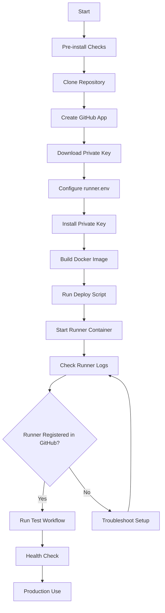

# Complete Installation Guide

## Installation Flowchart

---

Detailed step-by-step guide for installing and deploying GitHub Self-Hosted Runner from scratch.

## Table of Contents

- [Overview](#overview)
- [Prerequisites](#prerequisites)
- [Installation Process](#installation-process)
  - [Phase 1: Environment Setup](#phase-1-environment-setup)
  - [Phase 2: GitHub App Configuration](#phase-2-github-app-configuration)
  - [Phase 3: Runner Configuration](#phase-3-runner-configuration)
  - [Phase 4: Deployment](#phase-4-deployment)
  - [Phase 5: Verification](#phase-5-verification)
- [Post-Installation](#post-installation)
- [Advanced Scenarios](#advanced-scenarios)
- [Troubleshooting](#troubleshooting)
- [FAQ](#faq)

---

...